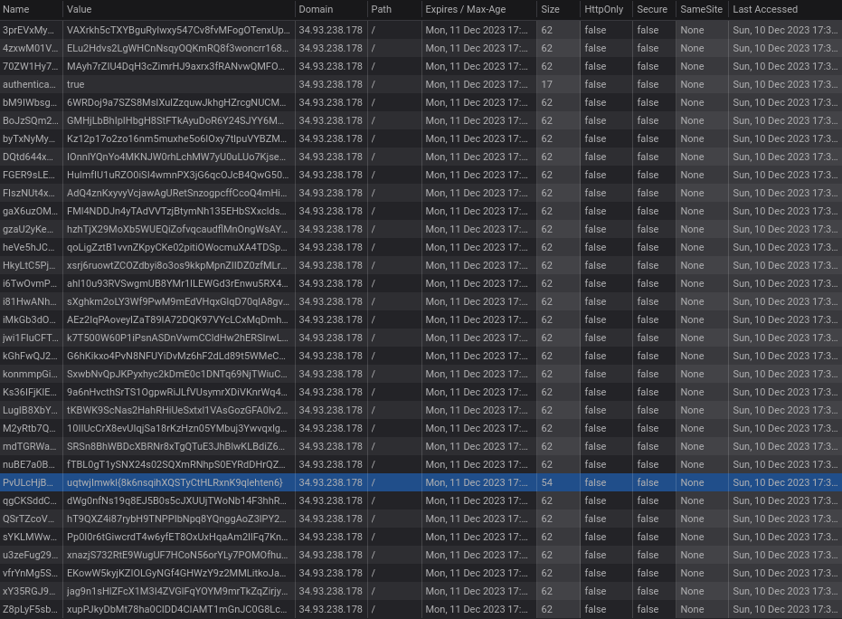

# Byte Crumbs Expedition

```
Embark on a journey into the digital wilderness where every byte leaves a trail. The Byte Crumbs Expedition beckons participants to follow the subtle traces of data, navigating through the vast expanse of bytes and breadcrumbs. Decode the mysteries concealed within outgoing requests as you embark on this cryptographic adventure.
```

# Solution

On visiting the site, the user was greeted with a login page. I logged in using a random email and pass.

Lets check the cookies. The webpage knows whether you are logged in or not by the cooke named "authenticated", when logged in, it has a value of "true".
Whats interesting is the other cookies with random data.



Out of all the cookies, one of them stands out due to its difference in  size.

Using [Caesar Cipher decoder](https://www.dcode.fr/caesar-cipher) , the flag was obtained.

```flag : cyberQuest{8s6vayqpFYABgKbPTZfvS9ytmpbmv6}```