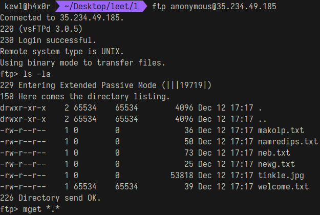
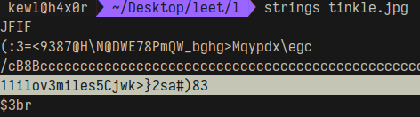
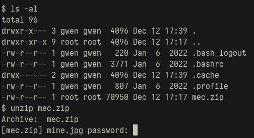
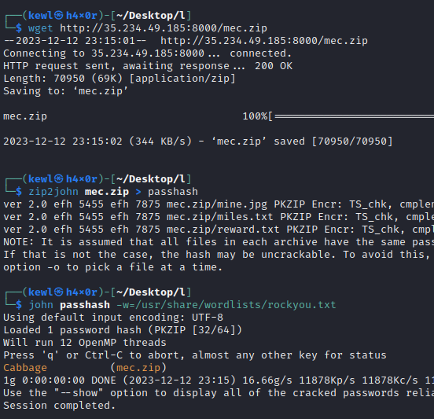
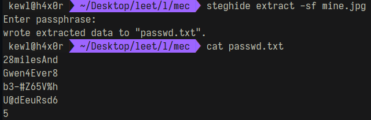
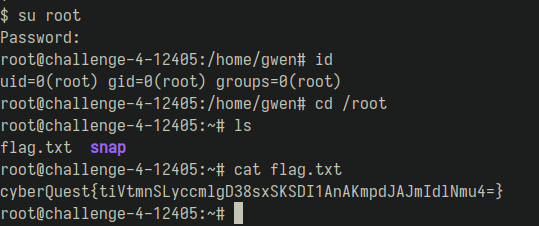

# Into The Cyber-verse

```
Navigate through a maze of love, unravel hidden messages, and breach cyber defenses to discover the ultimate flag. The IP address is your gateway—immerse yourself in a thrilling and exciting journey of decoding, bypassing obstacles, and claiming victory in the dynamic challenges that await.
```

# Solution
## Port Scan

```
PORT   STATE SERVICE REASON  VERSION
21/tcp open  ftp     syn-ack vsftpd 3.0.5
| ftp-anon: Anonymous FTP login allowed (FTP code 230)
|_Can't get directory listing: PASV IP 10.140.0.7 is not the same as 35.234.49.185
| ftp-syst: 
|   STAT: 
| FTP server status:
|      Connected to ::ffff:59.92.192.45
|      Logged in as ftp
|      TYPE: ASCII
|      No session bandwidth limit
|      Session timeout in seconds is 300
|      Control connection is plain text
|      Data connections will be plain text
|      At session startup, client count was 1
|      vsFTPd 3.0.5 - secure, fast, stable
|_End of status
22/tcp open  ssh     syn-ack OpenSSH 8.9p1 Ubuntu 3ubuntu0.4 (Ubuntu Linux; protocol 2.0)
| ssh-hostkey: 
|   256 baf306ae13d2fb0fc579114dc56743aa (ECDSA)
| ecdsa-sha2-nistp256 AAAAE2VjZHNhLXNoYTItbmlzdHAyNTYAAAAIbmlzdHAyNTYAAABBBCJ/th966EFr3T9TAJuNAcCfvMmpnj9Hux9NDh3izdjUbserEps8DO0iQlAJzEBBpQdam+g8QufT0eDoYHsUXGE=
|   256 c454d1f377db9382c8902205552f103f (ED25519)
|_ssh-ed25519 AAAAC3NzaC1lZDI1NTE5AAAAIIb2MfQMlw1f2duDBj9fdmTXBXkJi/WJEiWPqobLykta
80/tcp open  http    syn-ack nginx 1.18.0 (Ubuntu)
| http-methods: 
|_  Supported Methods: GET HEAD
|_http-title: Welcome to nginx!
|_http-server-header: nginx/1.18.0 (Ubuntu)
Service Info: OSs: Unix, Linux; CPE: cpe:/o:linux:linux_kernel
```

The host had ftp , http and ssh services running. The FTP server allows anonymous login.

 <br/>
I downloaded all the files onto my PC. On inspecting "tinkle.jpg" using strings commad, I found a readble text (highlighted) and "JFIF", indicating the file is indeed a JPEG file.
<br/>

It wasn't possible to view the file or run exfitool because the file was corrupted. On opening the file with GHex, I noticed that the magic number was different. I was able to view the file when I changed (C3 BF FF E0) to JPEG magic number (FF D8 FF E0).

Then I ran Exiftool and the readable text which was found earlier turned out to be a comment. (it looks more like a password)
```
Comment                         : 11ilov3miles5Cjwk>}2sa#)83
```
On inspecting the files names, I found that when some of them are reversed, its readable.

```
namredips => spiderman
neb => ben
newg => gwen
```

Using "gwen" as username and "11ilov3miles5Cjwk>}2sa#)83" as password, I was able to login through SSH.

Inside gwen's home directory, there was a zip file that was password protected
#### SSH
<br/>
I started a python http server in gwen's home folder, so that I could download the zip file on to my PC
```bash
python3 -m http.server
```

#### My PC

After downloading, I used zip2john to extract the password hash then used JTR to perform a dictionary attack.
The password for zip file was "Cabbage"
<br/>


mec.zip contained 3 files. 2 text files and a jpg file.<br/>
"miles.txt" contained 2 base64 encoded stings and a text message
```
aHR0cHM6Ly93d3cueW91dHViZS5jb20vd2F0Y2g/dj1xUUFteWhCWVdCcw==
aHR0cHM6Ly93d3cueW91dHViZS5jb20vd2F0Y2g/dj03SFdmd0xCcVNRNA==
i like miles but i hate & and $
```

Decoding them led me to 2 YT videos. One of them contained a password "74k&^*nh#$" (https://www.youtube.com/watch?v=7HWfwLBqSQ4).<br/>
Password after removing "&" and "\$" : 74k^*nh#

With this password, I was able to extract a file using StegHide.


The password was splitted into multiple lines. Joining them gave "28milesAnGwen4Ever8b3-#Z65V%hU@dEeuRsd65". Using this as the password for root user, I gained root access and I got the flag.

### SSH
