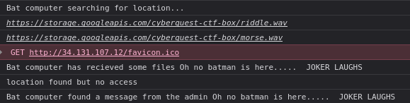
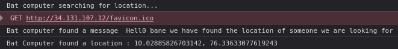
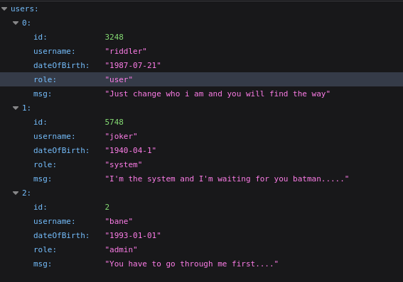
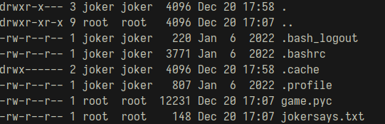

# Rescue Gotham

```
The Riddler, in a rare lapse of caution, has inadvertently disclosed vital information about his credentials on an anti-Gotham website. Leverage this opportunity to utilize the Batcomputer's capabilities and uncover the secrets of this clandestine anti-Gotham society.
```

# Solution
## Port scan
```
PORT     STATE SERVICE REASON  VERSION
22/tcp   open  ssh     syn-ack OpenSSH 8.9p1 Ubuntu 3ubuntu0.4 (Ubuntu Linux; protocol 2.0)
| ssh-hostkey: 
|   256 b8542c7691c06d60bd57a1b6c4c87d39 (ECDSA)
| ecdsa-sha2-nistp256 AAAAE2VjZHNhLXNoYTItbmlzdHAyNTYAAAAIbmlzdHAyNTYAAABBBKCYI0jMaGSTeL+CVkqgWCZ01eHp4zp0M+NFL4WNCtNgnZJ777Wap2sB7Yqr9/KAPfraNIVcvJBU+KLTbhc4dOc=
|   256 e44f1b9698e84669c7166a15920e4c6e (ED25519)
|_ssh-ed25519 AAAAC3NzaC1lZDI1NTE5AAAAIEFrgDLkipqKarG944bvcrOvgtjexT90v6FFJ1LuaKsN
80/tcp   open  http    syn-ack nginx 1.18.0 (Ubuntu)
|_http-title: Site doesn't have a title (text/html).
| http-methods: 
|_  Supported Methods: GET HEAD
|_http-server-header: nginx/1.18.0 (Ubuntu)
```

## Port 80
The http server hosted a wepage with login functionality. On viewing the source code I found a username and a password =>
`riddler:pl3sd0n0tli3` <br/>

After loggin in , I saw these on the dev tools console.
 <br/>
Also, there was a JWT stored in local storage with the key "token".

Using an online morse code decoder, I decoded the two wave files.
"morse.wav" contained `DELETETHIS321YEKTERCES` and "riddle.wav" contained `RIDDLEMETHIS,BATMAN`.

## jwt token

I decoded the JWT and and the payload was
```json
{
  "id": 3248,
  "username": "riddler",
  "dateOfBirth": "1987-07-21",
  "role": "user",
  "iat": 1703092407,
  "exp": 1703096007
}
```
I changed the role from "user" to "admin" and created a new token with "321YEKTERCES" as key (from morse.wav file)

Then I modified the JWT in local storage with the newly generated one and reloded the page. This time the console contained these


The coordinates pointed to a vehicle body shop with the name "JokerLap"


## hidden endpoint

On the web page, when "Sign In" was clicked, a request was sent to "https://ctfc6-ildqz7ssta-el.a.run.app/login". To find out if other endpoints exists, I ran ffuf on the host with big.txt from Seclists as the wordlist.
```
_ah                     [Status: 401, Size: 297, Words: 17, Lines: 11]
flag                    [Status: 200, Size: 68, Words: 11, Lines: 1]
images                  [Status: 301, Size: 179, Words: 7, Lines: 11]
javascripts             [Status: 301, Size: 189, Words: 7, Lines: 11]
stylesheets             [Status: 301, Size: 189, Words: 7, Lines: 11]
usrs                    [Status: 200, Size: 385, Words: 25, Lines: 1]
verify                  [Status: 401, Size: 73, Words: 11, Lines: 1]
```

The endpoint /usrs gave this


There were there users and the user joker was given the role of "system". Indicating that the player was supoposed to login as joker through SSH

## SSH, SVG & GitHub

I was able to login through SSH using `joker:jokerlap`

Inside joker's user folder, there were 2 intersting files.


"game.pyc" - A compiled python file<br/>
"jokersays.txt" - Some random text

I saw a code in SVG format while reading the contents of game.py also there were some text that was commented out
```xml
<!------aHR0cHM6Ly93d3cueW91dHViZS5jb20vd2F0Y2g/dj1vTDdQU2xVdVdQcw== ----->
<!------------- why so seriouX? -------------------------------------->
<!-- choose between one life OR the other  ?...... 524a42515266445653405b780662416e43060776564e415678510b67194f43506a774c7c7a04467747567a7e6206546f707d797513620c4e...... -->
```

When I saw "OR", my first guess was that the text was XORed using another string. The svg gave a QR which then lead me to a GitHGub repository.
When I checked the commit history, some texts were removed from the file "hidden.txt"

```
KEY=13 4 7
CUSTOM_TOXIN_DEVELOPMENT=YES
COMPROMISED_ALLIES_USE=YES
DARK_ALLIANCE=YES
DRONE_BACKUP=YES
```

## flag

To get the flag, I XORed "524a42515266445653405b780662416e43060776564e415678510b67194f43506a774c7c7a04467747567a7e6206546f707d797513620c4" with "13 4 7"

```python
from itertools import cycle
a=bytes.fromhex("524a42515266445653405b780662416e43060776564e415678510b67194f43506a774c7c7a04467747567a7e6206546f707d797513620c4e").decode('utf-8')
b="13 4 7"

d=""
for i,j in zip(cycle(b), a):
	d+=chr(ord(i)^ord(j))
	
print(d)
```

`flag : cyberQuest{O7QaZc16EvzaaIb+S9xrcJClKK7fCgaKMB2tXANYA3U=}`