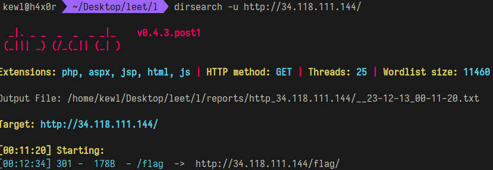

# Subtle Concealment

```
In the realm where shadows dance, a challenge lies,
A labyrinth of secrets, where the curious one flies.
Through the cyber corridors, a maze untold,
In the binary whispers, a tale unfolds.

In the echoing silence of the server's might,
A web of intrigue, veiled in the digital night.
Directories hidden, like phantoms they roam,
The seeker must decipher, the enigma to comb.

In the land of bytes, where pixels play,
Cryptic whispers, a clandestine relay.
Behind the pixels, a covert script,
A message encrypted, in shadows softly adrift.
```

# Solutions
## Port Scan
```
PORT     STATE SERVICE REASON  VERSION
21/tcp   open  ftp     syn-ack vsftpd 3.0.5
| ftp-syst: 
|   STAT: 
| FTP server status:
|      Connected to ::ffff:59.92.192.45
|      Logged in as ftp
|      TYPE: ASCII
|      No session bandwidth limit
|      Session timeout in seconds is 300
|      Control connection is plain text
|      Data connections will be plain text
|      At session startup, client count was 1
|      vsFTPd 3.0.5 - secure, fast, stable
|_End of status
| ftp-anon: Anonymous FTP login allowed (FTP code 230)
|_Can't get directory listing: PASV IP 10.186.15.205 is not the same as 34.118.111.144
22/tcp   open  ssh     syn-ack OpenSSH 8.9p1 Ubuntu 3ubuntu0.4 (Ubuntu Linux; protocol 2.0)
| ssh-hostkey: 
|   256 dbbeea5e9f313aa30e14950f07834f78 (ECDSA)
| ecdsa-sha2-nistp256 AAAAE2VjZHNhLXNoYTItbmlzdHAyNTYAAAAIbmlzdHAyNTYAAABBBDVQR+LrynrIDh1KmMmsuRMxuagg+pZ6RYyB5RCc26GhCfw+gCd7KLdcEYkAlpi4odE6hw47IDdRC98rODXw2sM=
|   256 eea8a6d370015b5a4f9d6b3ad3d2e66f (ED25519)
|_ssh-ed25519 AAAAC3NzaC1lZDI1NTE5AAAAILbXDXUNgcFaLuULeWZVczkSDV67mHnpRfTxqTuxEXij
80/tcp   open  http    syn-ack nginx 1.18.0 (Ubuntu)
| http-methods: 
|_  Supported Methods: GET HEAD POST OPTIONS
|_http-favicon: Unknown favicon MD5: 691A08EF0ABB466A0232A78D2D5E1A76
|_http-title: Site doesn't have a title (text/plain).
|_http-server-header: nginx/1.18.0 (Ubuntu)
```

The host had ftp , http and ssh services running. The FTP server allows anonymous login. 

### Dirsearch output

On visiting "flag" directory, there was a text file named flag.txt. The file contained a bunch of filenames and pathnames. I used this as a dirlist and ran dirsearch on the host.
```
[00:18:23] 301 -  178B  - /notallowed  ->  http://34.118.111.144/notallowed/
```
Then I found a file named "flag.txt" in /notallowed/www/html.

```
gcfivUyiwx{erAWph9mfz+md9Ajh1dB3YCqP9LZ35HkTRMWHs2fsKM=}
```
Shifting the charactes by 2 steps backwards gave the flag
```
cyberQuest{anWSld9ibv+iz9Wfd1zX3UYmL9HV35DgPNISDo2boGI=}
```